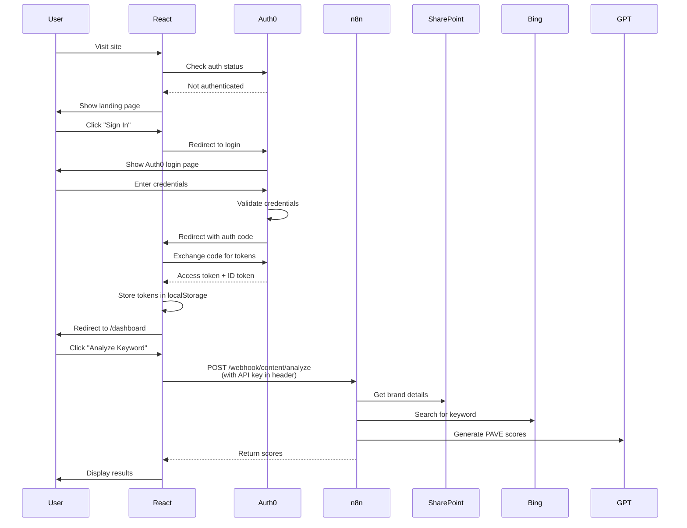

# Complete Auth0 Authentication Implementation Guide
## AI Content Copilot Platform - Frontend Authentication

---

## 📋 Table of Contents

1. [Auth0 Account Setup](#auth0-account-setup)
2. [Project Configuration](#project-configuration)
3. [Complete Code Implementation](#complete-code-implementation)
4. [User Flow & Testing](#user-flow--testing)
5. [Production Deployment](#production-deployment)

---

## 🔐 Part 1: Auth0 Account Setup

### Step 1.1: Create Auth0 Account

1. Go to [https://auth0.com/](https://auth0.com/)
2. Click **"Sign Up"**
3. Choose **"Personal"** (free tier) or **"Company"** (paid)
4. Sign up with email or Google/GitHub
5. Verify your email

### Step 1.2: Create Application

Once logged into Auth0 dashboard:

1. Click **"Applications"** in left sidebar
2. Click **"Create Application"**
3. Enter application details:
   - **Name:** AI Content Copilot
   - **Type:** Select **"Single Page Web Applications"**
4. Click **"Create"**

### Step 1.3: Configure Application Settings

In your application settings page:

**Allowed Callback URLs:**
```
http://localhost:5173,
http://localhost:3000,
https://yourdomain.com,
https://www.yourdomain.com
```

**Allowed Logout URLs:**
```
http://localhost:5173,
http://localhost:3000,
https://yourdomain.com,
https://www.yourdomain.com
```

**Allowed Web Origins:**
```
http://localhost:5173,
http://localhost:3000,
https://yourdomain.com,
https://www.yourdomain.com
```

**Allowed Origins (CORS):**
```
http://localhost:5173,
http://localhost:3000,
https://yourdomain.com,
https://www.yourdomain.com
```

Click **"Save Changes"** at the bottom.

### Step 1.4: Note Your Credentials

From the **Settings** tab, copy these values (you'll need them later):

```
Domain: dev-xxxxx.us.auth0.com
Client ID: abc123xyz456...
```

### Step 1.5: Configure Branding (Optional but Recommended)

1. Go to **"Branding"** → **"Universal Login"**
2. Upload your logo
3. Choose primary color
4. Customize login page text

---

## ⚙️ Part 2: Project Configuration

### Step 2.1: Install Dependencies

```bash
cd frontend
npm install @auth0/auth0-react
```

### Step 2.2: Create Environment Variables

Create `.env` file in your frontend root:

```bash
# .env
VITE_AUTH0_DOMAIN=dev-xxxxx.us.auth0.com
VITE_AUTH0_CLIENT_ID=your_client_id_here
VITE_AUTH0_AUDIENCE=https://ai-content-copilot-api
VITE_N8N_API_URL=https://your-n8n-instance.com
VITE_N8N_API_KEY=your_n8n_secret_key
```

**Important:** Add `.env` to `.gitignore`:
```bash
echo ".env" >> .gitignore
```

---

## 💻 Part 3: Complete Code Implementation

### Step 3.1: Project Structure

```
frontend/
├── src/
│   ├── components/
│   │   ├── layout/
│   │   │   ├── Navbar.jsx
│   │   │   ├── Sidebar.jsx
│   │   │   └── MainLayout.jsx
│   │   ├── auth/
│   │   │   ├── LoginButton.jsx
│   │   │   ├── LogoutButton.jsx
│   │   │   └── ProtectedRoute.jsx
│   │   └── common/
│   │       ├── LoadingSpinner.jsx
│   │       └── ErrorBoundary.jsx
│   ├── pages/
│   │   ├── Home.jsx
│   │   ├── Dashboard.jsx
│   │   ├── AnalyzeKeyword.jsx
│   │   ├── ContentBacklog.jsx
│   │   ├── CreateBrief.jsx
│   │   └── ProduceContent.jsx
│   ├── hooks/
│   │   ├── useAuth.js
│   │   └── useApi.js
│   ├── services/
│   │   ├── api.js
│   │   └── content.js
│   ├── App.jsx
│   └── main.jsx
├── .env
└── package.json
```

---

### Step 3.2: Auth0 Provider Setup

```jsx
// src/main.jsx
import React from 'react';
import ReactDOM from 'react-dom/client';
import { BrowserRouter } from 'react-router-dom';
import { Auth0Provider } from '@auth0/auth0-react';
import App from './App';
import './index.css';

const root = ReactDOM.createRoot(document.getElementById('root'));

root.render(
  <React.StrictMode>
    <BrowserRouter>
      <Auth0Provider
        domain={import.meta.env.VITE_AUTH0_DOMAIN}
        clientId={import.meta.env.VITE_AUTH0_CLIENT_ID}
        authorizationParams={{
          redirect_uri: window.location.origin,
          audience: import.meta.env.VITE_AUTH0_AUDIENCE,
          scope: "openid profile email"
        }}
        cacheLocation="localstorage"
        useRefreshTokens={true}
      >
        <App />
      </Auth0Provider>
    </BrowserRouter>
  </React.StrictMode>
);
```

**Key Parameters Explained:**
- `domain`: Your Auth0 tenant domain
- `clientId`: Your application client ID
- `redirect_uri`: Where Auth0 redirects after login
- `audience`: API identifier (optional, for API access tokens)
- `scope`: User information you want access to
- `cacheLocation`: Store tokens in localStorage (persists across tabs)
- `useRefreshTokens`: Automatically refresh expired tokens

---

### Step 3.3: Custom Auth Hook

```jsx
// src/hooks/useAuth.js
import { useAuth0 } from '@auth0/auth0-react';

export function useAuth() {
  const {
    user,
    isAuthenticated,
    isLoading,
    error,
    loginWithRedirect,
    logout,
    getAccessTokenSilently
  } = useAuth0();

  const signIn = () => {
    loginWithRedirect({
      appState: { returnTo: '/dashboard' }
    });
  };

  const signOut = () => {
    logout({
      logoutParams: {
        returnTo: window.location.origin
      }
    });
  };

  const getToken = async () => {
    try {
      const token = await getAccessTokenSilently({
        authorizationParams: {
          audience: import.meta.env.VITE_AUTH0_AUDIENCE
        }
      });
      return token;
    } catch (error) {
      console.error('Error getting token:', error);
      return null;
    }
  };

  return {
    user,
    isAuthenticated,
    isLoading,
    error,
    signIn,
    signOut,
    getToken
  };
}
```

---

### Step 3.4: Protected Route Component

```jsx
// src/components/auth/ProtectedRoute.jsx
import { Navigate, useLocation } from 'react-router-dom';
import { useAuth } from '../../hooks/useAuth';
import LoadingSpinner from '../common/LoadingSpinner';

export default function ProtectedRoute({ children }) {
  const { isAuthenticated, isLoading } = useAuth();
  const location = useLocation();

  // Show loading spinner while checking auth
  if (isLoading) {
    return (
      <div className="min-h-screen flex items-center justify-center">
        <LoadingSpinner />
      </div>
    );
  }

  // Redirect to home if not authenticated
  if (!isAuthenticated) {
    return <Navigate to="/" state={{ from: location }} replace />;
  }

  // Render protected content
  return children;
}
```

---

### Step 3.5: Loading Spinner Component

```jsx
// src/components/common/LoadingSpinner.jsx
export default function LoadingSpinner({ size = 'md', text = 'Loading...' }) {
  const sizeClasses = {
    sm: 'w-8 h-8',
    md: 'w-12 h-12',
    lg: 'w-16 h-16'
  };

  return (
    <div className="flex flex-col items-center justify-center space-y-4">
      <div className={`${sizeClasses[size]} border-4 border-blue-200 border-t-blue-600 rounded-full animate-spin`}></div>
      {text && <p className="text-gray-600 text-sm">{text}</p>}
    </div>
  );
}
```

---

### Step 3.6: Login Button Component

```jsx
// src/components/auth/LoginButton.jsx
import { useAuth } from '../../hooks/useAuth';

export default function LoginButton() {
  const { signIn, isLoading } = useAuth();

  return (
    <button
      onClick={signIn}
      disabled={isLoading}
      className="bg-blue-600 hover:bg-blue-700 text-white font-semibold px-6 py-2 rounded-lg transition-colors disabled:bg-gray-400 disabled:cursor-not-allowed"
    >
      {isLoading ? 'Loading...' : 'Sign In'}
    </button>
  );
}
```

---

### Step 3.7: Logout Button Component

```jsx
// src/components/auth/LogoutButton.jsx
import { useAuth } from '../../hooks/useAuth';

export default function LogoutButton() {
  const { signOut, user } = useAuth();

  return (
    <div className="flex items-center space-x-3">
      <div className="text-right">
        <p className="text-sm font-medium text-gray-700">{user?.name}</p>
        <p className="text-xs text-gray-500">{user?.email}</p>
      </div>
      {user?.picture && (
        
      )}
      <button
        onClick={signOut}
        className="bg-red-500 hover:bg-red-600 text-white px-4 py-2 rounded-lg transition-colors"
      >
        Sign Out
      </button>
    </div>
  );
}
```

---

### Step 3.8: Home/Landing Page (Public)

```jsx
// src/pages/Home.jsx
import { useAuth } from '../hooks/useAuth';
import { Navigate } from 'react-router-dom';
import LoginButton from '../components/auth/LoginButton';

export default function Home() {
  const { isAuthenticated, isLoading } = useAuth();

  // Redirect to dashboard if already logged in
  if (isAuthenticated) {
    return <Navigate to="/dashboard" replace />;
  }

  // Show loading state
  if (isLoading) {
    return (
      <div className="min-h-screen flex items-center justify-center">
        <div className="animate-pulse text-gray-600">Loading...</div>
      </div>
    );
  }

  return (
    <div className="min-h-screen bg-gradient-to-br from-blue-50 via-white to-indigo-50">
      {/* Header */}
      <header className="bg-white shadow-sm">
        <div className="max-w-7xl mx-auto px-4 sm:px-6 lg:px-8 py-4 flex justify-between items-center">
          <div className="flex items-center space-x-2">
            <div className="w-10 h-10 bg-blue-600 rounded-lg flex items-center justify-center">
              <span className="text-white font-bold text-xl">AI</span>
            </div>
            <h1 className="text-2xl font-bold text-gray-900">Content Copilot</h1>
          </div>
          <LoginButton />
        </div>
      </header>

      {/* Hero Section */}
      <main className="max-w-7xl mx-auto px-4 sm:px-6 lg:px-8 py-20">
        <div className="text-center">
          <h1 className="text-5xl font-extrabold text-gray-900 sm:text-6xl">
            AI-Powered Content
            <span className="text-blue-600"> Strategy Platform</span>
          </h1>
          <p className="mt-6 text-xl text-gray-600 max-w-3xl mx-auto">
            Analyze keywords, generate PAVE scores, create authority briefs, and produce
            high-quality investigative content—all powered by AI.
          </p>
          <div className="mt-10">
            <LoginButton />
          </div>
        </div>

        {/* Features Grid */}
        <div className="mt-24 grid md:grid-cols-3 gap-8">
          <div className="bg-white p-6 rounded-xl shadow-lg">
            <div className="w-12 h-12 bg-blue-100 rounded-lg flex items-center justify-center mb-4">
              <svg className="w-6 h-6 text-blue-600" fill="none" stroke="currentColor" viewBox="0 0 24 24">
                <path strokeLinecap="round" strokeLinejoin="round" strokeWidth={2} d="M9 19v-6a2 2 0 00-2-2H5a2 2 0 00-2 2v6a2 2 0 002 2h2a2 2 0 002-2zm0 0V9a2 2 0 012-2h2a2 2 0 012 2v10m-6 0a2 2 0 002 2h2a2 2 0 002-2m0 0V5a2 2 0 012-2h2a2 2 0 012 2v14a2 2 0 01-2 2h-2a2 2 0 01-2-2z" />
              </svg>
            </div>
            <h3 className="text-xl font-semibold text-gray-900 mb-2">PAVE Scoring</h3>
            <p className="text-gray-600">
              AI-powered keyword analysis with Profitability, Authority, Volume, and Effort scores.
            </p>
          </div>

          <div className="bg-white p-6 rounded-xl shadow-lg">
            <div className="w-12 h-12 bg-green-100 rounded-lg flex items-center justify-center mb-4">
              <svg className="w-6 h-6 text-green-600" fill="none" stroke="currentColor" viewBox="0 0 24 24">
                <path strokeLinecap="round" strokeLinejoin="round" strokeWidth={2} d="M9 12h6m-6 4h6m2 5H7a2 2 0 01-2-2V5a2 2 0 012-2h5.586a1 1 0 01.707.293l5.414 5.414a1 1 0 01.293.707V19a2 2 0 01-2 2z" />
              </svg>
            </div>
            <h3 className="text-xl font-semibold text-gray-900 mb-2">Authority Briefs</h3>
            <p className="text-gray-600">
              Generate comprehensive content briefs tailored to your brand voice and audience.
            </p>
          </div>

          <div className="bg-white p-6 rounded-xl shadow-lg">
            <div className="w-12 h-12 bg-purple-100 rounded-lg flex items-center justify-center mb-4">
              <svg className="w-6 h-6 text-purple-600" fill="none" stroke="currentColor" viewBox="0 0 24 24">
                <path strokeLinecap="round" strokeLinejoin="round" strokeWidth={2} d="M13 10V3L4 14h7v7l9-11h-7z" />
              </svg>
            </div>
            <h3 className="text-xl font-semibold text-gray-900 mb-2">Content Production</h3>
            <p className="text-gray-600">
              Produce complete HTML articles with cover images, ready to publish.
            </p>
          </div>
        </div>
      </main>
    </div>
  );
}
```

---

### Step 3.9: Main Layout Component

```jsx
// src/components/layout/MainLayout.jsx
import { Outlet } from 'react-router-dom';
import Navbar from './Navbar';
import Sidebar from './Sidebar';

export default function MainLayout() {
  return (
    <div className="min-h-screen bg-gray-50">
      <Navbar />
      <div className="flex">
        <Sidebar />
        <main className="flex-1 p-8">
          <Outlet />
        </main>
      </div>
    </div>
  );
}
```

---

### Step 3.10: Navbar Component

```jsx
// src/components/layout/Navbar.jsx
import { useAuth } from '../../hooks/useAuth';
import LogoutButton from '../auth/LogoutButton';

export default function Navbar() {
  const { isAuthenticated } = useAuth();

  if (!isAuthenticated) return null;

  return (
    <nav className="bg-white shadow-sm border-b border-gray-200">
      <div className="max-w-7xl mx-auto px-4 sm:px-6 lg:px-8">
        <div className="flex justify-between items-center h-16">
          <div className="flex items-center space-x-3">
            <div className="w-10 h-10 bg-blue-600 rounded-lg flex items-center justify-center">
              <span className="text-white font-bold text-xl">AI</span>
            </div>
            <h1 className="text-xl font-bold text-gray-900">Content Copilot</h1>
          </div>
          <LogoutButton />
        </div>
      </div>
    </nav>
  );
}
```

---

### Step 3.11: Sidebar Component

```jsx
// src/components/layout/Sidebar.jsx
import { NavLink } from 'react-router-dom';

const navigation = [
  { name: 'Dashboard', href: '/dashboard', icon: '📊' },
  { name: 'Analyze Keyword', href: '/analyze', icon: '🔍' },
  { name: 'Content Backlog', href: '/backlog', icon: '📋' },
  { name: 'Create Brief', href: '/brief', icon: '📝' },
  { name: 'Produce Content', href: '/produce', icon: '⚡' },
  { name: 'Published', href: '/published', icon: '🚀' }
];

export default function Sidebar() {
  return (
    <aside className="w-64 bg-white border-r border-gray-200 min-h-screen">
      <nav className="p-4 space-y-2">
        {navigation.map((item) => (
          <NavLink
            key={item.name}
            to={item.href}
            className={({ isActive }) =>
              `flex items-center space-x-3 px-4 py-3 rounded-lg transition-colors ${
                isActive
                  ? 'bg-blue-50 text-blue-700 font-semibold'
                  : 'text-gray-700 hover:bg-gray-50'
              }`
            }
          >
            <span className="text-2xl">{item.icon}</span>
            <span>{item.name}</span>
          </NavLink>
        ))}
      </nav>
    </aside>
  );
}
```

---

### Step 3.12: Dashboard Page (Protected)

```jsx
// src/pages/Dashboard.jsx
import { useAuth } from '../hooks/useAuth';

export default function Dashboard() {
  const { user } = useAuth();

  return (
    <div>
      <div className="mb-8">
        <h1 className="text-3xl font-bold text-gray-900">
          Welcome back, {user?.name || 'User'}! 👋
        </h1>
        <p className="text-gray-600 mt-2">Here's your content production overview</p>
      </div>

      {/* Stats Grid */}
      <div className="grid md:grid-cols-4 gap-6 mb-8">
        <div className="bg-white p-6 rounded-lg shadow">
          <p className="text-sm text-gray-600 mb-1">Ideas Analyzed</p>
          <p className="text-3xl font-bold text-gray-900">24</p>
          <p className="text-sm text-green-600 mt-2">↑ 12% from last week</p>
        </div>

        <div className="bg-white p-6 rounded-lg shadow">
          <p className="text-sm text-gray-600 mb-1">Approved for Briefing</p>
          <p className="text-3xl font-bold text-gray-900">8</p>
          <p className="text-sm text-blue-600 mt-2">3 pending review</p>
        </div>

        <div className="bg-white p-6 rounded-lg shadow">
          <p className="text-sm text-gray-600 mb-1">In Production</p>
          <p className="text-3xl font-bold text-gray-900">5</p>
          <p className="text-sm text-orange-600 mt-2">2 ready to publish</p>
        </div>

        <div className="bg-white p-6 rounded-lg shadow">
          <p className="text-sm text-gray-600 mb-1">Published</p>
          <p className="text-3xl font-bold text-gray-900">42</p>
          <p className="text-sm text-purple-600 mt-2">This month</p>
        </div>
      </div>

      {/* Recent Activity */}
      <div className="bg-white rounded-lg shadow">
        <div className="p-6 border-b border-gray-200">
          <h2 className="text-xl font-semibold text-gray-900">Recent Activity</h2>
        </div>
        <div className="p-6">
          <p className="text-gray-500">Activity feed coming soon...</p>
        </div>
      </div>
    </div>
  );
}
```

---

### Step 3.13: API Service with Auth Token

```jsx
// src/services/api.js
const N8N_API_URL = import.meta.env.VITE_N8N_API_URL;
const N8N_API_KEY = import.meta.env.VITE_N8N_API_KEY;

class ApiService {
  constructor() {
    this.baseUrl = N8N_API_URL;
    this.apiKey = N8N_API_KEY;
  }

  async request(endpoint, options = {}) {
    const url = `${this.baseUrl}${endpoint}`;
    
    const headers = {
      'Content-Type': 'application/json',
      'X-API-Key': this.apiKey,
      ...options.headers
    };

    try {
      const response = await fetch(url, {
        ...options,
        headers
      });

      if (!response.ok) {
        const error = await response.json();
        throw new Error(error.message || 'API request failed');
      }

      return await response.json();
    } catch (error) {
      console.error('API Error:', error);
      throw error;
    }
  }

  // Brand endpoints
  async getBrands() {
    return this.request('/webhook/brands/list');
  }

  async getBrandDetails(brandId) {
    return this.request(`/webhook/brands/${brandId}`);
  }

  // Content endpoints
  async analyzeKeyword(data) {
    return this.request('/webhook/content/analyze', {
      method: 'POST',
      body: JSON.stringify(data)
    });
  }

  async saveIdea(data) {
    return this.request('/webhook/content/save', {
      method: 'POST',
      body: JSON.stringify(data)
    });
  }

  async getBacklog(params) {
    const query = new URLSearchParams(params).toString();
    return this.request(`/webhook/content/backlog?${query}`);
  }

  async getContentDetails(id) {
    return this.request(`/webhook/content/details/${id}`);
  }

  async generateBrief(data) {
    return this.request('/webhook/brief/generate', {
      method: 'POST',
      body: JSON.stringify(data)
    });
  }

  async produceContent(id) {
    return this.request('/webhook/content/produce', {
      method: 'POST',
      body: JSON.stringify({ item_id: id })
    });
  }
}

export const api = new ApiService();
```

---

### Step 3.14: Custom API Hook

```jsx
// src/hooks/useApi.js
import { useState, useEffect } from 'react';
import { api } from '../services/api';

export function useApi(apiCall, dependencies = []) {
  const [data, setData] = useState(null);
  const [loading, setLoading] = useState(true);
  const [error, setError] = useState(null);

  useEffect(() => {
    let isMounted = true;

    async function fetchData() {
      try {
        setLoading(true);
        setError(null);
        const result = await apiCall();
        if (isMounted) {
          setData(result);
        }
      } catch (err) {
        if (isMounted) {
          setError(err.message);
        }
      } finally {
        if (isMounted) {
          setLoading(false);
        }
      }
    }

    fetchData();

    return () => {
      isMounted = false;
    };
  }, dependencies);

  return { data, loading, error };
}

// Usage example:
// const { data: brands, loading, error } = useApi(() => api.getBrands());
```

---

### Step 3.15: Complete App Router

```jsx
// src/App.jsx
import { Routes, Route, Navigate } from 'react-router-dom';
import { useAuth } from './hooks/useAuth';
import ProtectedRoute from './components/auth/ProtectedRoute';
import MainLayout from './components/layout/MainLayout';
import LoadingSpinner from './components/common/LoadingSpinner';

// Pages
import Home from './pages/Home';
import Dashboard from './pages/Dashboard';
import AnalyzeKeyword from './pages/AnalyzeKeyword';
import ContentBacklog from './pages/ContentBacklog';
import CreateBrief from './pages/CreateBrief';
import ProduceContent from './pages/ProduceContent';
import Published from './pages/Published';

export default function App() {
  const { isLoading } = useAuth();

  // Show loading while Auth0 initializes
  if (isLoading) {
    return (
      <div className="min-h-screen flex items-center justify-center">
        <LoadingSpinner size="lg" text="Initializing..." />
      </div>
    );
  }

  return (
    <Routes>
      {/* Public route */}
      <Route path="/" element={<Home />} />

      {/* Protected routes with layout */}
      <Route element={
        <ProtectedRoute>
          <MainLayout />
        </ProtectedRoute>
      }>
        <Route path="/dashboard" element={<Dashboard />} />
        <Route path="/analyze" element={<AnalyzeKeyword />} />
        <Route path="/backlog" element={<ContentBacklog />} />
        <Route path="/brief" element={<CreateBrief />} />
        <Route path="/produce" element={<ProduceContent />} />
        <Route path="/published" element={<Published />} />
      </Route>

      {/* Catch all - redirect to home */}
      <Route path="*" element={<Navigate to="/" replace />} />
    </Routes>
  );
}
```

---

### Step 3.16: Sample Protected Page

```jsx
// src/pages/AnalyzeKeyword.jsx
import { useState } from 'react';
import { useApi } from '../hooks/useApi';
import { api } from '../services/api';
import LoadingSpinner from '../components/common/LoadingSpinner';

export default function AnalyzeKeyword() {
  const { data: brandsData, loading: brandsLoading } = useApi(() => api.getBrands());
  const [brandId, setBrandId] = useState('');
  const [keyword, setKeyword] = useState('');
  const [analyzing, setAnalyzing] = useState(false);
  const [results, setResults] = useState(null);

  const handleAnalyze = async () => {
    if (!brandId || !keyword) return;

    setAnalyzing(true);
    try {
      const data = await api.analyzeKeyword({ brand_id: brandId, keyword });
      setResults(data);
    } catch (error) {
      alert('Analysis failed: ' + error.message);
    } finally {
      setAnalyzing(false);
    }
  };

  if (brandsLoading) {
    return <LoadingSpinner text="Loading brands..." />;
  }

  return (
    <div className="max-w-4xl mx-auto">
      <h1 className="text-3xl font-bold text-gray-900 mb-8">Analyze Keyword</h1>

      <div className="bg-white rounded-lg shadow p-6 mb-6">
        <div className="space-y-4">
          <div>
            <label className="block text-sm font-medium text-gray-700 mb-2">
              Select Brand
            </label>
            <select
              value={brandId}
              onChange={(e) => setBrandId(e.target.value)}
              className="w-full px-4 py-2 border border-gray-300 rounded-lg focus:ring-2 focus:ring-blue-500 focus:border-transparent"
            >
              <option value="">-- Select a brand --</option>
              {brandsData?.brands?.map((brand) => (
                <option key={brand.id} value={brand.id}>
                  {brand.name}
                </option>
              ))}
            </select>
          </div>

          <div>
            <label className="block text-sm font-medium text-gray-700 mb-2">
              Keyword
            </label>
            <input
              type="text"
              value={keyword}
              onChange={(e) => setKeyword(e.target.value)}
              placeholder="e.g., best vitamin D supplements"
              className="w-full px-4 py-2 border border-gray-300 rounded-lg focus:ring-2 focus:ring-blue-500 focus:border-transparent"
            />
          </div>

          <button
            onClick={handleAnalyze}
            disabled={!brandId || !keyword || analyzing}
            className="w-full bg-blue-600 hover:bg-blue-700 text-white font-semibold py-3 rounded-lg transition-colors disabled:bg-gray-400 disabled:cursor-not-allowed"
          >
            {analyzing ? 'Analyzing...' : 'Analyze with AI'}
          </button>
        </div>
      </div>

      {results && (
        <div className="bg-white rounded-lg shadow p-6">
          <h2 className="text-xl font-semibold mb-4">PAVE Scores</h2>
          <pre className="bg-gray-50 p-4 rounded overflow-auto">
            {JSON.stringify(results, null, 2)}
          </pre>
        </div>
      )}
    </div>
  );
}
```

---

## 🧪 Part 4: User Flow & Testing

### User Flow Diagram



### Testing Checklist

#### ✅ Auth0 Integration Tests

**Test 1: Initial Load**
- [ ] Visit http://localhost:5173
- [ ] Should see landing page (not logged in)
- [ ] "Sign In" button should be visible

**Test 2: Login Flow**
- [ ] Click "Sign In"
- [ ] Should redirect to Auth0 login page
- [ ] Domain should be `dev-xxxxx.us.auth0.com`
- [ ] Enter test credentials
- [ ] Should redirect back to your app
- [ ] Should land on `/dashboard`
- [ ] Should see user name and profile picture in navbar

**Test 3: Token Persistence**
- [ ] Login successfully
- [ ] Close browser tab
- [ ] Open new tab to http://localhost:5173
- [ ] Should automatically redirect to `/dashboard` (still logged in)
- [ ] Check localStorage - should see `auth0` keys

**Test 4: Protected Routes**
- [ ] While logged out, try to visit `/dashboard` directly
- [ ] Should redirect to home page
- [ ] Login
- [ ] Should be able to access all protected routes

**Test 5: API Calls**
- [ ] Login
- [ ] Go to "Analyze Keyword" page
- [ ] Open browser DevTools → Network tab
- [ ] Select a brand and keyword, click "Analyze"
- [ ] Should see POST request to n8n
- [ ] Request should include `X-API-Key` header
- [ ] Should receive PAVE scores back

**Test 6: Logout**
- [ ] Click "Sign Out" button
- [ ] Should redirect to home page
- [ ] Should clear localStorage
- [ ] Trying to visit `/dashboard` should redirect to home

**Test 7: Token Refresh (Advanced)**
- [ ] Login
- [ ] Wait for token to expire (or set short expiry in Auth0)
- [ ] Make an API call
- [ ] Auth0 should automatically refresh token
- [ ] Call should succeed

#### 🔒 Security Tests

**Test 8: API Key Protection**
- [ ] Try calling n8n endpoint directly without API key
- [ ] Should get 401 Unauthorized
- [ ] With correct API key, should work

**Test 9: CORS Protection**
- [ ] Try calling n8n from different domain
- [ ] Should be blocked by CORS
- [ ] From your domain, should work

---

## 🚀 Part 5: Production Deployment

### Step 5.1: Update Auth0 Production URLs

In Auth0 dashboard, update URLs to production:

**Allowed Callback URLs:**
```
https://yourdomain.com,
https://www.yourdomain.com
```

**Allowed Logout URLs:**
```
https://yourdomain.com,
https://www.yourdomain.com
```

### Step 5.2: Production Environment Variables

Create `.env.production`:

```bash
VITE_AUTH0_DOMAIN=your-production-tenant.auth0.com
VITE_AUTH0_CLIENT_ID=prod_client_id
VITE_AUTH0_AUDIENCE=https://api.yourdomain.com
VITE_N8N_API_URL=https://n8n.yourdomain.com
VITE_N8N_API_KEY=prod_secret_key
```

### Step 5.3: Deploy Frontend (Vercel)

```bash
# Install Vercel CLI
npm install -g vercel

# Deploy
vercel

# Set environment variables in Vercel dashboard
# Go to: Project Settings → Environment Variables
# Add all VITE_* variables
```

### Step 5.4: Deploy n8n

Ensure n8n webhook URLs match production:
```
https://n8n.yourdomain.com/webhook/brands/list
https://n8n.yourdomain.com/webhook/content/analyze
```

### Step 5.5: SSL/HTTPS

Both your frontend and n8n MUST use HTTPS in production.

---

## 📊 Summary

### What You Built

✅ **Complete Auth0 Integration**
- Social login (Google, GitHub, Microsoft)
- Email/password authentication
- Token management with auto-refresh
- Session persistence across tabs

✅ **Protected Routes**
- Public landing page
- Private dashboard and app pages
- Automatic redirects

✅ **API Integration**
- Secure API calls to n8n
- API key protection
- Error handling

✅ **Professional UI**
- Landing page with features
- Dashboard layout with sidebar
- User profile display
- Responsive design

### Total Implementation Time

- **Auth0 Setup:** 30 minutes
- **Code Implementation:** 4-5 hours
- **Testing:** 1 hour
- **Deployment:** 30 minutes
- **Total:** ~6 hours

### Key Benefits

🔒 **Enterprise Security** - Auth0 handles all security concerns  
⚡ **Fast Implementation** - Pre-built authentication flows  
🎨 **Customizable UI** - Full control over login experience  
🔄 **Auto Token Refresh** - Seamless user experience  
📱 **Social Logins** - Google, Microsoft, GitHub support  
🌍 **Multi-Factor Auth** - Available out-of-box (paid tier)

---

## 🆘 Troubleshooting

### Issue: "Invalid Callback URL"
**Solution:** Add your exact URL to Auth0 Allowed Callback URLs

### Issue: Infinite Redirect Loop
**Solution:** Clear localStorage and cookies, check Auth0 domain/clientId

### Issue: "Access Denied"
**Solution:** Check Auth0 user permissions, verify audience parameter

### Issue: API Calls Failing
**Solution:** Verify n8n API key, check CORS settings, confirm webhook URLs

---

## 📚 Additional Resources

- [Auth0 React Quickstart](https://auth0.com/docs/quickstart/spa/react)
- [Auth0 API Authorization](https://auth0.com/docs/authorization/apis)
- [n8n Webhook Documentation](https://docs.n8n.io/integrations/builtin/core-nodes/n8n-nodes-base.webhook/)

---

**You're all set!** 🎉 Your Auth0 authentication is production-ready.
