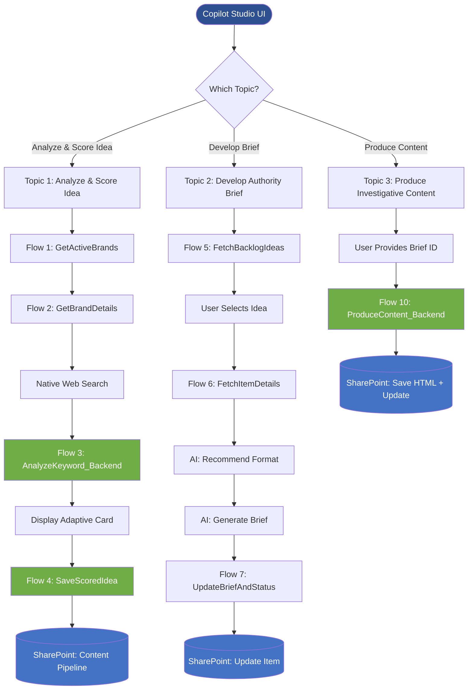

## Flow 1: GetActiveBrands


## Flow 2: GetBrandDetails
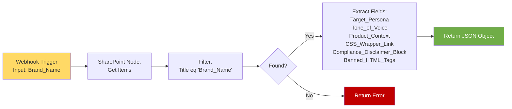

## Flow 3: AnalyzeKeyword_Backend (PAVE Scorer)
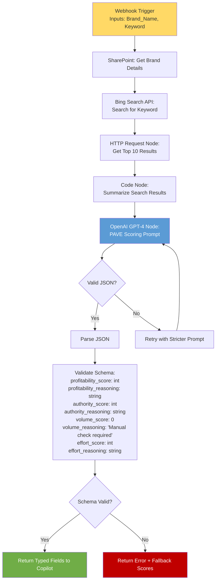

## Flow 4: SaveScoredIdea (Auto-Approval)
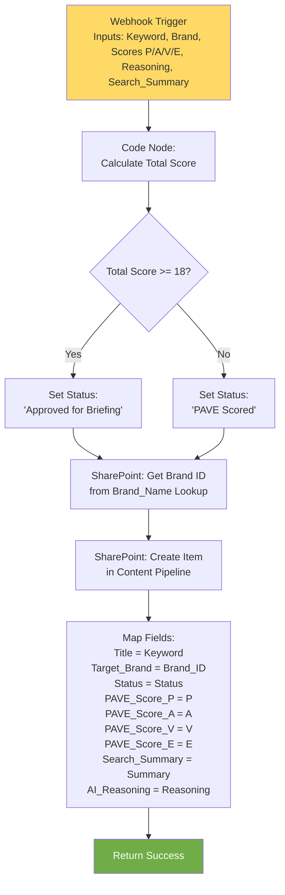

## Flow 5: FetchBacklogIdeas
```mermaid
flowchart LR
    A[Webhook Trigger<br/>No Inputs] --> B[SharePoint: Get Items<br/>Content Pipeline]
    B --> C[Filter:<br/>Status eq 'Approved for Briefing']
    C --> D[Sort By:<br/>PAVE_Score_P DESC]
    D --> E[Limit: Top 5]
    E --> F[Code Node: Format Loop]
    F --> G[Build String:<br/>'Title: X | ID: Y\n']
    G --> H[Return Formatted List]
    
    style A fill:#FFD966
    style H fill:#70AD47,color:#fff
```

## Flow 6: FetchItemDetails
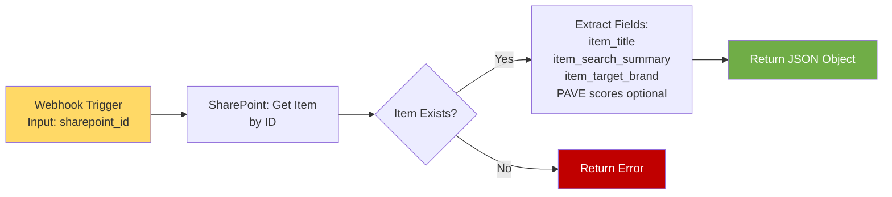

## Flow 7: UpdateBriefAndStatus
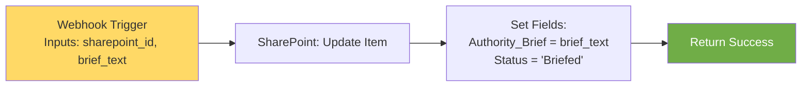

## Flow 8: UpdateContentStatus (INFERRED)
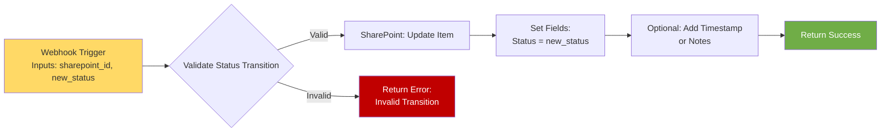

## Flow 9: PublishContent (INFERRED)
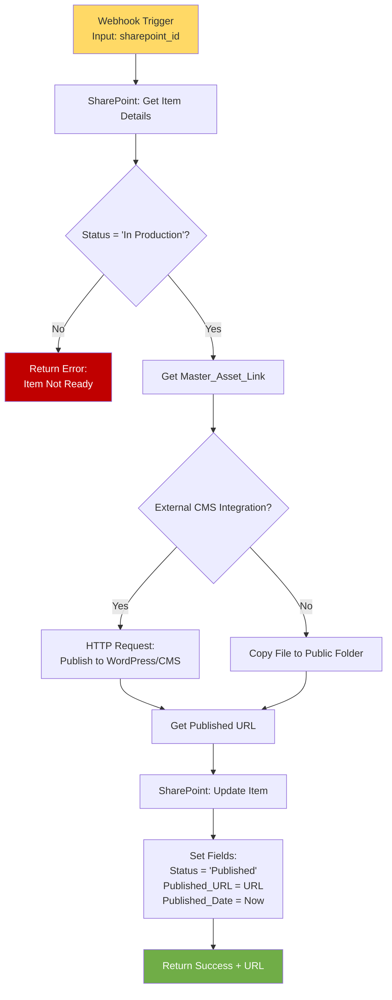

## Flow 10: ProduceContent_Backend (The Writer)
```mermaid
flowchart TD
    A[Webhook Trigger<br/>Input: sharepoint_id] --> B[SharePoint: Get Item Details]
    B --> C[Extract:<br/>Title, Search_Summary, Authority_Brief]
    C --> D[SharePoint: Get Brand Details<br/>via Target_Brand Lookup]
    D --> E[Extract Brand Context:<br/>Persona, Tone, Banned_Tags, Disclaimer]
    
    E --> F[OpenAI GPT-4 Node:<br/>Investigative Writer Prompt]
    F --> G[System Prompt:<br/>'You are investigative reporter'<br/>Persona: X, Tone: Y<br/>Two-source rule<br/>Output HTML only<br/>Banned tags: Z]
    G --> H[Generate HTML Body]
    
    H --> I[DALL-E 3 Node:<br/>Generate Cover Image]
    I --> J[Get Image URL]
    
    J --> K[HTTP Request:<br/>Fetch CSS_Wrapper_Link]
    K --> L[Code Node:<br/>String Replacement]
    L --> M[Replace:<br/>{{CONTENT}} → HTML_Body<br/>{{COVER_IMAGE_URL}} → Image_URL]
    
    M --> N[SharePoint: Create File]
    N --> O[Filename: Title.html<br/>Content: Final HTML]
    O --> P[Get File URL]
    
    P --> Q[SharePoint: Update Item]
    Q --> R[Set Fields:<br/>Master_Asset_Link = File_URL<br/>Status = 'In Production']
    R --> S[Return Success + Link]
    
    style A fill:#FFD966
    style F fill:#5B9BD5,color:#fff
    style I fill:#5B9BD5,color:#fff
    style S fill:#70AD47,color:#fff
```

## Complete System Architecture (n8n)
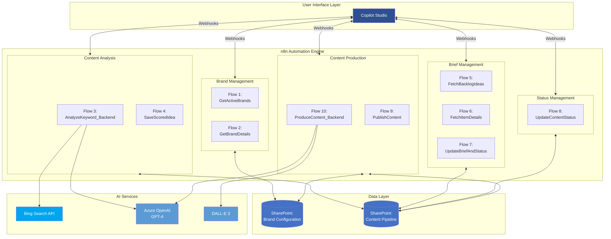

## Data Flow: Topic 1 (Analyze & Score Idea)
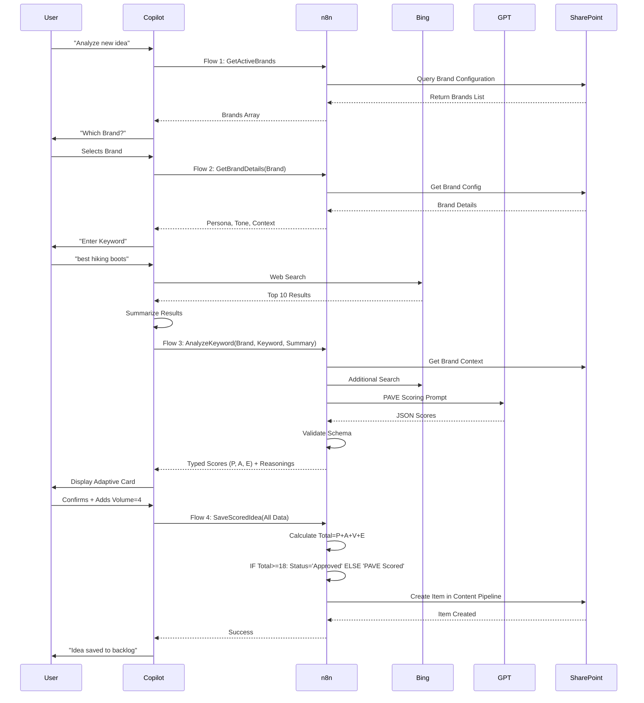

## Data Flow: Topic 2 (Develop Authority Brief)
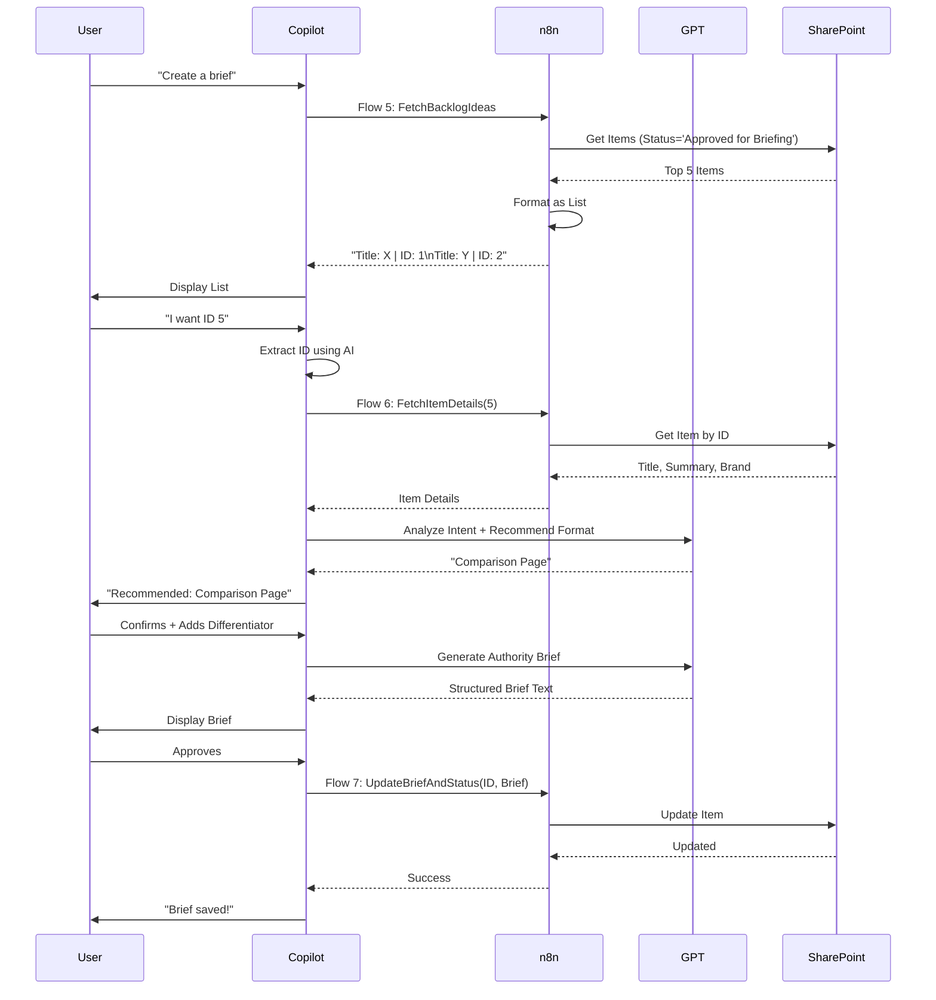

## Data Flow: Topic 3 (Produce Investigative Content)
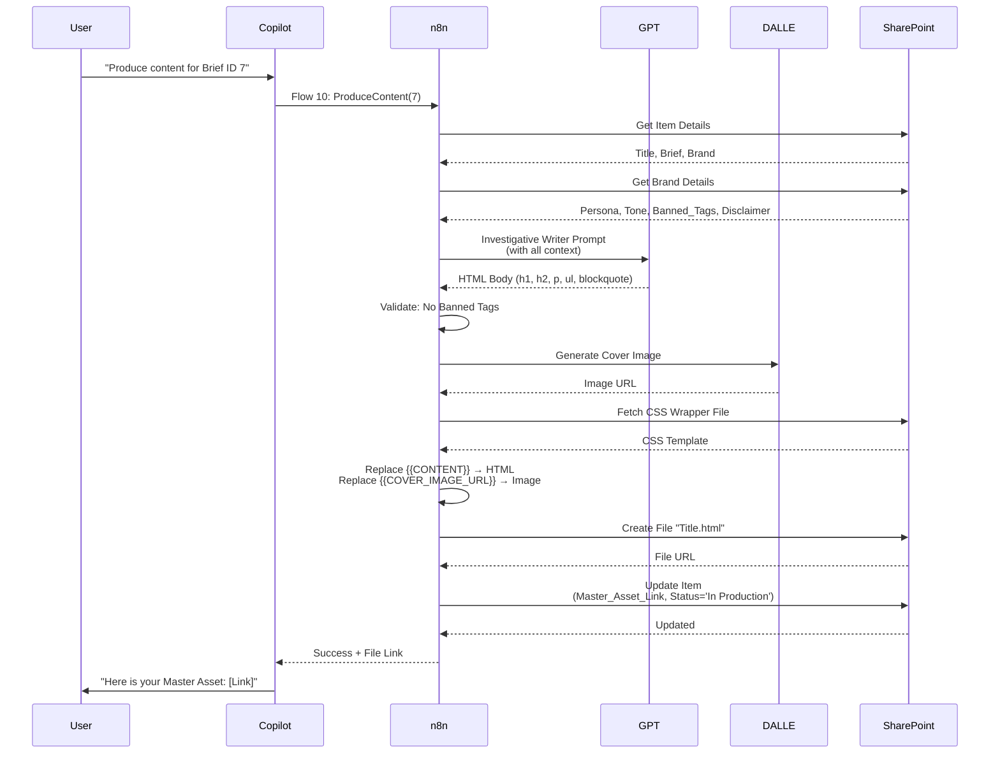
