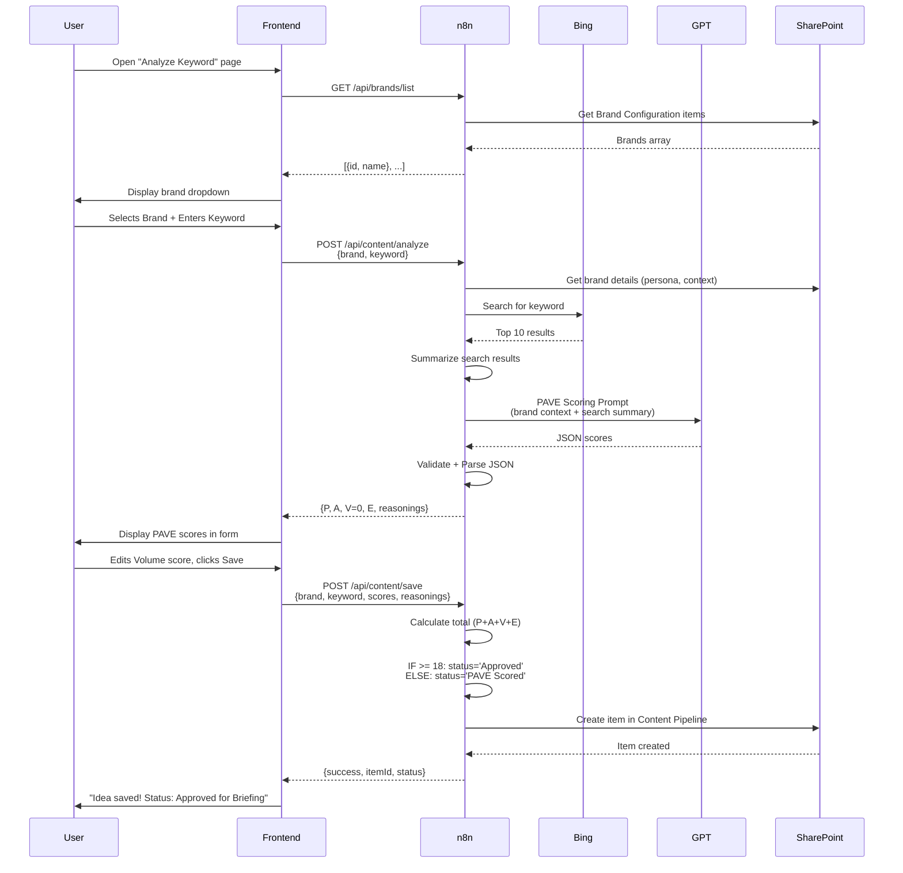
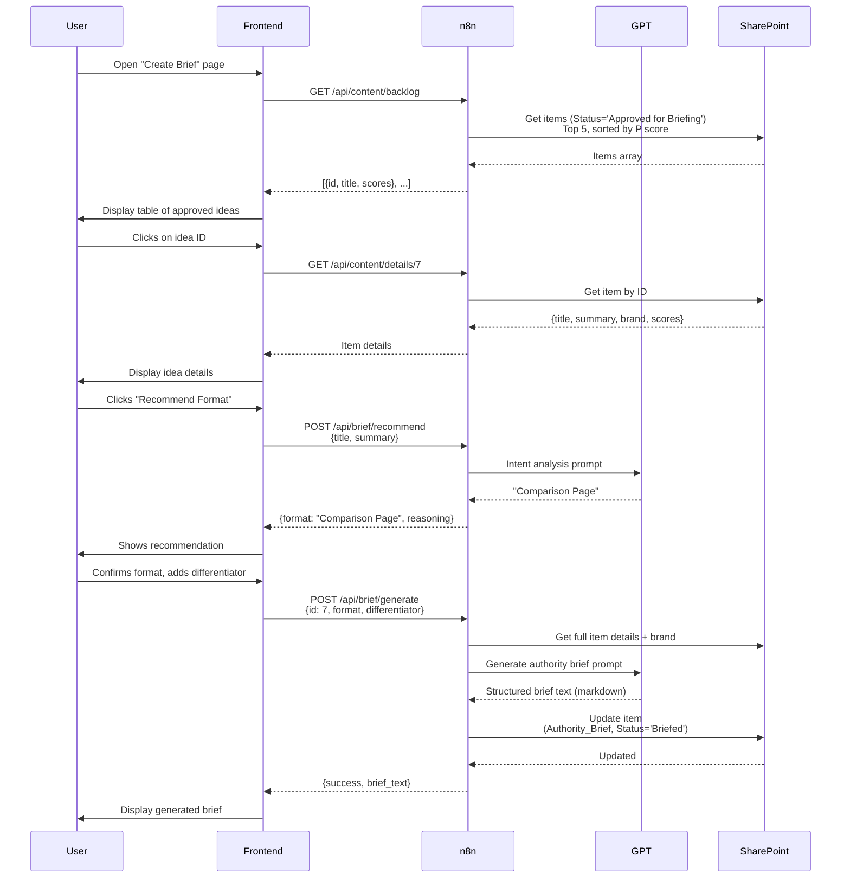
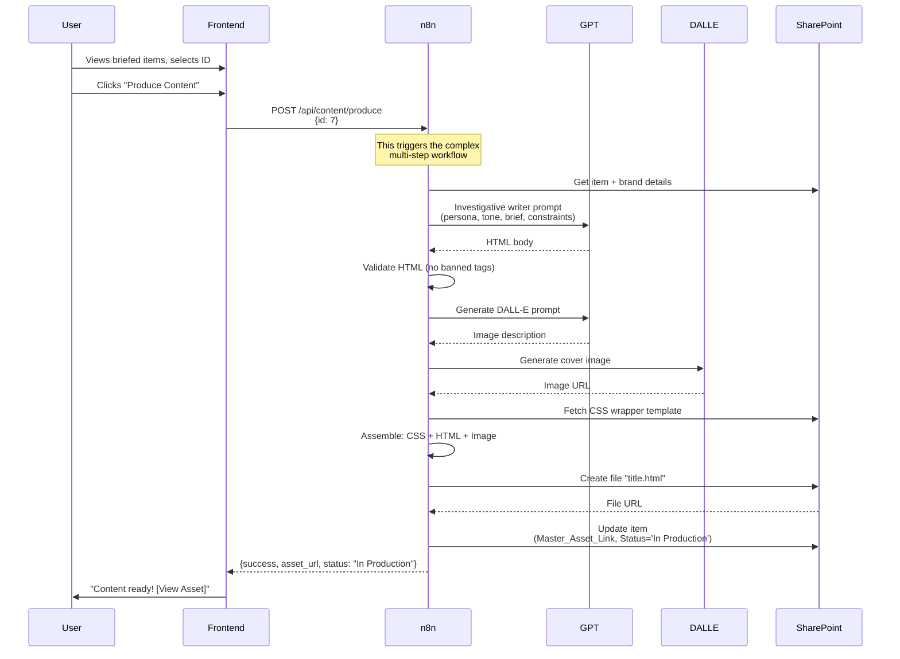
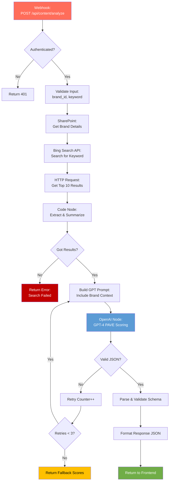
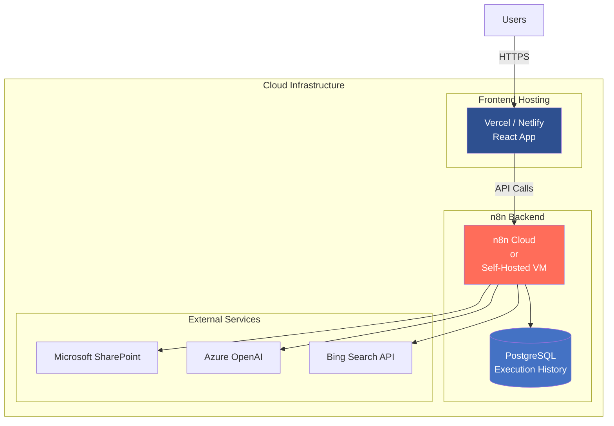

# AI Content Copilot Platform - Pure n8n Architecture
## Complete System Design (No Copilot Studio)

---

## 🎯 New Architecture Overview

```mermaid
flowchart TB
    subgraph Frontend["Custom Web Frontend"]
        UI[React/Vue Dashboard]
        Form1[Analyze Keyword Form]
        Form2[Create Brief Interface]
        Form3[Produce Content Interface]
        List[Content Pipeline View]
    end
    
    subgraph n8n["n8n - Complete Intelligence Engine"]
        direction TB
        
        subgraph API["API Layer - Webhooks"]
            W1[/auth/login]
            W2[/brands/list]
            W3[/content/analyze]
            W4[/content/save]
            W5[/content/backlog]
            W6[/content/details]
            W7[/brief/update]
            W8[/content/status]
            W9[/content/publish]
            W10[/content/produce]
        end
        
        subgraph Intelligence["Intelligence Layer"]
            Search[Web Search Engine]
            AI[AI Orchestration]
            Valid[Validation Logic]
            Assembly[Content Assembly]
        end
        
        subgraph Data["Data Operations"]
            SPRead[SharePoint Reads]
            SPWrite[SharePoint Writes]
            FileOps[File Operations]
        end
    end
    
    subgraph External["External Services"]
        Bing[Bing Search API]
        GPT[Azure OpenAI GPT-4]
        DALLE[DALL-E 3]
        SP[(SharePoint)]
    end
    
    UI --> W1
    Form1 --> W2
    Form1 --> W3
    Form1 --> W4
    Form2 --> W5
    Form2 --> W6
    Form2 --> W7
    Form3 --> W10
    List --> W5
    List --> W8
    
    API --> Intelligence
    Intelligence --> Data
    
    Search --> Bing
    AI --> GPT
    AI --> DALLE
    Data --> SP
    
    style Frontend fill:#2E5090,color:#fff
    style n8n fill:#FF6D5A,color:#fff
    style External fill:#4472C4,color:#fff
```

---

## 🆕 Key Changes from Copilot Version

| Aspect | Old (with Copilot) | New (Pure n8n) |
|--------|-------------------|----------------|
| **UI Layer** | Microsoft Copilot Studio | Custom React/Vue frontend |
| **Conversational AI** | Built-in Copilot features | n8n orchestrates GPT for chat (optional) |
| **User Authentication** | Microsoft 365 | Custom auth (JWT) or Microsoft OAuth |
| **Intelligence** | Split between Copilot & n8n | 100% in n8n |
| **Web Search** | Copilot native search | n8n → Bing API directly |
| **Licensing Costs** | Copilot Studio + Power Automate | n8n only (way cheaper!) |
| **Customization** | Limited by Copilot constraints | Fully customizable |
| **Deployment** | Microsoft ecosystem only | Any cloud provider |

---

## 🏗️ Complete System Architecture

### Frontend Options

#### Option A: React Dashboard (Recommended)
```
Tech Stack:
- React 18 with TypeScript
- TailwindCSS for styling
- React Query for API state management
- React Router for navigation
- Axios for n8n API calls

Pages:
1. Login/Dashboard
2. Analyze New Idea
3. Content Backlog (table view)
4. Create Authority Brief
5. Produce Content
6. Published Content Gallery
```

#### Option B: Vue.js Dashboard
```
Tech Stack:
- Vue 3 with Composition API
- Vuetify for UI components
- Pinia for state management
- Vue Router
- Axios for API calls
```

#### Option C: Simple HTML + Vanilla JS (Fastest MVP)
```
Tech Stack:
- Pure HTML5/CSS3
- Vanilla JavaScript
- Fetch API for n8n calls
- No build process needed
- Deploy as static site
```

---

## 🔄 Updated User Journeys

### Journey 1: Analyze & Score New Idea



### Journey 2: Develop Authority Brief



### Journey 3: Produce Investigative Content



---

## 📋 Complete API Specification for n8n

### Authentication Endpoints

#### POST /api/auth/login
**Purpose:** User authentication  
**Input:**
```json
{
  "email": "user@example.com",
  "password": "hashed_password"
}
```
**Output:**
```json
{
  "success": true,
  "token": "jwt_token_here",
  "user": {
    "id": 1,
    "name": "John Doe",
    "role": "content_manager"
  }
}
```

---

### Brand Management Endpoints

#### GET /api/brands/list
**Purpose:** Get all active brands  
**Headers:** `Authorization: Bearer {token}`  
**Output:**
```json
{
  "brands": [
    {"id": 1, "name": "Vit Cornu"},
    {"id": 2, "name": "EcoLife"}
  ]
}
```

#### GET /api/brands/{id}
**Purpose:** Get brand details  
**Output:**
```json
{
  "id": 1,
  "name": "Vit Cornu",
  "persona": "Health-conscious millennials...",
  "tone": "Professional yet approachable",
  "product_context": "Vitamin supplements...",
  "css_wrapper": "https://...",
  "disclaimer": "This is not medical advice...",
  "banned_tags": "table, iframe, float"
}
```

---

### Content Analysis Endpoints

#### POST /api/content/analyze
**Purpose:** Analyze keyword and generate PAVE scores  
**Input:**
```json
{
  "brand_id": 1,
  "keyword": "best vitamin D supplements"
}
```
**Process (inside n8n):**
1. Get brand details from SharePoint
2. Bing search for keyword
3. Summarize results
4. Call GPT-4 with PAVE scoring prompt
5. Validate and parse JSON
6. Return scores

**Output:**
```json
{
  "success": true,
  "keyword": "best vitamin D supplements",
  "brand": "Vit Cornu",
  "search_summary": "Top results show comparison articles...",
  "pave_scores": {
    "profitability": {
      "score": 4,
      "reasoning": "High commercial intent with affiliate opportunities"
    },
    "authority": {
      "score": 3,
      "reasoning": "Medium competition from health sites"
    },
    "volume": {
      "score": 0,
      "reasoning": "Manual check required"
    },
    "effort": {
      "score": 4,
      "reasoning": "Standard blog with product comparisons"
    }
  },
  "ai_reasoning": "Strong opportunity for product-focused content..."
}
```

#### POST /api/content/save
**Purpose:** Save analyzed idea to Content Pipeline  
**Input:**
```json
{
  "brand_id": 1,
  "keyword": "best vitamin D supplements",
  "pave_scores": {
    "P": 4,
    "A": 3,
    "V": 4,
    "E": 4
  },
  "search_summary": "...",
  "ai_reasoning": "..."
}
```
**Output:**
```json
{
  "success": true,
  "item_id": 42,
  "status": "Approved for Briefing",
  "total_score": 15
}
```

---

### Content Backlog Endpoints

#### GET /api/content/backlog
**Purpose:** Get approved ideas waiting for briefing  
**Query Params:** `?status=Approved for Briefing&limit=10`  
**Output:**
```json
{
  "items": [
    {
      "id": 42,
      "title": "best vitamin D supplements",
      "brand": "Vit Cornu",
      "pave_scores": {"P": 4, "A": 3, "V": 4, "E": 4},
      "total_score": 15,
      "created_date": "2026-02-01"
    }
  ],
  "total": 5
}
```

#### GET /api/content/details/{id}
**Purpose:** Get full details for a content item  
**Output:**
```json
{
  "id": 42,
  "title": "best vitamin D supplements",
  "brand": "Vit Cornu",
  "status": "Approved for Briefing",
  "pave_scores": {"P": 4, "A": 3, "V": 4, "E": 4},
  "search_summary": "...",
  "ai_reasoning": "...",
  "authority_brief": null,
  "master_asset_link": null
}
```

#### GET /api/content/pipeline
**Purpose:** Get all content items with filtering  
**Query Params:**
- `?status=Published`
- `?brand_id=1`
- `?sort=created_date&order=desc`
- `?page=1&limit=20`

**Output:**
```json
{
  "items": [...],
  "pagination": {
    "total": 145,
    "page": 1,
    "per_page": 20,
    "total_pages": 8
  }
}
```

---

### Brief Generation Endpoints

#### POST /api/brief/recommend
**Purpose:** AI recommendation for content format  
**Input:**
```json
{
  "title": "best vitamin D supplements",
  "search_summary": "..."
}
```
**Output:**
```json
{
  "recommended_format": "Comparison Page",
  "reasoning": "High commercial intent suggests product comparison",
  "alternatives": ["In-depth Guide", "Listicle"]
}
```

#### POST /api/brief/generate
**Purpose:** Generate authority brief  
**Input:**
```json
{
  "item_id": 42,
  "format": "Comparison Page",
  "differentiator": "Focus on bioavailability",
  "sme_input": "Dr. Smith's research on D3 vs D2"
}
```
**Output:**
```json
{
  "success": true,
  "brief": "# Authority Brief\n\n## Content Goal\n...",
  "word_count": 850,
  "estimated_production_time": "3-4 hours"
}
```

#### PUT /api/brief/update/{id}
**Purpose:** Update existing brief  
**Input:**
```json
{
  "brief_text": "Updated brief content..."
}
```

---

### Content Production Endpoints

#### POST /api/content/produce
**Purpose:** Full content generation (HTML + Image + Assembly)  
**Input:**
```json
{
  "item_id": 42
}
```
**Process (Complex n8n workflow):**
1. Get item + brand details
2. Generate HTML with GPT-4
3. Generate cover image with DALL-E 3
4. Fetch CSS wrapper
5. Assemble final HTML
6. Save to SharePoint
7. Update item status

**Output:**
```json
{
  "success": true,
  "asset_url": "https://sharepoint.com/.../best-vitamin-d-supplements.html",
  "status": "In Production",
  "generation_time": "2m 34s",
  "word_count": 2400,
  "image_url": "https://..."
}
```

**Error Response:**
```json
{
  "success": false,
  "error": "DALLE_TIMEOUT",
  "message": "Image generation timed out after 90s",
  "partial_result": {
    "html_generated": true,
    "image_generated": false
  },
  "retry_suggested": true
}
```

---

### Status Management Endpoints

#### PUT /api/content/status/{id}
**Purpose:** Update content status  
**Input:**
```json
{
  "new_status": "Published",
  "notes": "Published to WordPress on 2026-02-05"
}
```
**Validation:**
- Check valid status transition
- Ensure required fields present for status

**Output:**
```json
{
  "success": true,
  "previous_status": "In Production",
  "new_status": "Published",
  "updated_at": "2026-02-05T14:30:00Z"
}
```

---

### Publishing Endpoints

#### POST /api/content/publish
**Purpose:** Publish content to external CMS or public folder  
**Input:**
```json
{
  "item_id": 42,
  "publish_to": "wordpress",
  "category": "supplements",
  "tags": ["vitamin-d", "health"]
}
```
**Output:**
```json
{
  "success": true,
  "published_url": "https://vitcornu.com/best-vitamin-d-supplements",
  "publish_date": "2026-02-05T14:30:00Z",
  "status": "Published"
}
```

---

## 🎨 Frontend Development Specification

### React Dashboard Structure

```
/src
  /components
    /layout
      Navbar.jsx
      Sidebar.jsx
      Footer.jsx
    /forms
      AnalyzeKeywordForm.jsx
      CreateBriefForm.jsx
      ProduceContentForm.jsx
    /common
      LoadingSpinner.jsx
      ErrorAlert.jsx
      SuccessNotification.jsx
      PAVEScoreCard.jsx
  /pages
    Dashboard.jsx
    AnalyzeIdea.jsx
    ContentBacklog.jsx
    CreateBrief.jsx
    ProduceContent.jsx
    PublishedGallery.jsx
  /services
    api.js (Axios instance)
    auth.js
    content.js
  /hooks
    useContent.js
    useBrands.js
  /utils
    validators.js
    formatters.js
  App.jsx
  main.jsx
```

### Key React Components

#### 1. AnalyzeKeywordForm.jsx
```jsx
Features:
- Brand dropdown (fetches from /api/brands/list)
- Keyword input field
- "Analyze" button → POST /api/content/analyze
- Loading state during analysis
- PAVE scores display (editable)
- Volume score manual input
- "Save to Backlog" button
```

#### 2. ContentBacklogTable.jsx
```jsx
Features:
- Table view of all approved ideas
- Sortable columns (P, A, V, E, Total)
- Filter by brand
- Filter by status
- Click row → View details
- Batch operations (select multiple)
```

#### 3. BriefGenerator.jsx
```jsx
Features:
- Item selection dropdown
- Format recommendation button
- Format selector (dropdown)
- Differentiator input
- SME input
- "Generate Brief" button
- Brief preview (markdown rendered)
- Edit brief functionality
- Save button
```

#### 4. ContentProducer.jsx
```jsx
Features:
- Briefed items list
- "Produce Content" button
- Progress indicator (multi-step)
  - Generating HTML...
  - Creating cover image...
  - Assembling final asset...
- Preview generated HTML (iframe)
- Download HTML button
- View in SharePoint button
```

### UI/UX Wireframes

```
┌─────────────────────────────────────────────────┐
│  AI Content Copilot       [User] [Logout]       │
├─────────────────────────────────────────────────┤
│  Dashboard  │  Analyze  │  Backlog  │  Produce  │
├─────────────────────────────────────────────────┤
│                                                  │
│  Analyze New Keyword Idea                       │
│  ┌──────────────────────────────────────┐       │
│  │ Select Brand: [Vit Cornu ▼]         │       │
│  │                                       │       │
│  │ Keyword: [____________________]       │       │
│  │                                       │       │
│  │ [Analyze with AI]                    │       │
│  └──────────────────────────────────────┘       │
│                                                  │
│  PAVE Scores (AI Generated)                     │
│  ┌──────────────────────────────────────┐       │
│  │ Profitability: [4] ⭐⭐⭐⭐☆           │       │
│  │ "High commercial intent..."           │       │
│  │                                       │       │
│  │ Authority: [3] ⭐⭐⭐☆☆               │       │
│  │ "Medium competition..."               │       │
│  │                                       │       │
│  │ Volume: [_] (Manual Entry Required)  │       │
│  │                                       │       │
│  │ Effort: [4] ⭐⭐⭐⭐☆                │       │
│  │ "Standard blog format..."             │       │
│  │                                       │       │
│  │ Total Score: 15 / 20                 │       │
│  │ Status: PAVE Scored                  │       │
│  │                                       │       │
│  │ [Save to Backlog]                    │       │
│  └──────────────────────────────────────┘       │
└─────────────────────────────────────────────────┘
```

---

## 🔧 n8n Workflow Updates (Without Copilot)

### Updated Flow 1: GetActiveBrands

```mermaid
flowchart LR
    A[Webhook:<br/>GET /api/brands/list] --> B{Authenticated?}
    B -->|No| C[Return 401 Unauthorized]
    B -->|Yes| D[SharePoint:<br/>Get Brand Configuration]
    D --> E[Code: Extract Brand Names]
    E --> F[Format JSON Response]
    F --> G[Return: {brands: [...]}]
    
    style A fill:#FF6D5A,color:#fff
    style G fill:#70AD47,color:#fff
    style C fill:#C00000,color:#fff
```

### Updated Flow 3: AnalyzeKeyword (Most Changed)

**Key Difference:** n8n now does BOTH the search AND the AI analysis (Copilot used to do the search)



**Implementation Details:**

1. **Webhook Configuration:**
   - Method: POST
   - Path: `/api/content/analyze`
   - Authentication: JWT token validation

2. **Bing Search Step:**
   ```javascript
   // Code Node: Bing Search Request
   const keyword = $json.keyword;
   const bingApiKey = $env.BING_API_KEY;
   
   const response = await $http.request({
     method: 'GET',
     url: 'https://api.bing.microsoft.com/v7.0/search',
     headers: {
       'Ocp-Apim-Subscription-Key': bingApiKey
     },
     qs: {
       q: keyword,
       count: 10,
       mkt: 'en-US'
     }
   });
   
   return { searchResults: response.webPages.value };
   ```

3. **Summarization Step:**
   ```javascript
   // Code Node: Summarize Search Results
   const results = $json.searchResults;
   const summary = results.map((r, i) => 
     `${i+1}. ${r.name}\n   ${r.snippet}\n   ${r.url}`
   ).join('\n\n');
   
   return { 
     search_summary: summary.substring(0, 2000) // Limit length
   };
   ```

4. **GPT Prompt Assembly:**
   ```javascript
   // Code Node: Build PAVE Scoring Prompt
   const prompt = `You are an SEO strategist. Return ONLY valid JSON (no markdown).

Brand: ${$json.brand_name}
Persona: ${$json.brand_persona}
Product context: ${$json.brand_product_context}
Keyword: ${$json.keyword}
Search summary: ${$json.search_summary}

Rules:
- Keep each reasoning <= 15 words.
- volume_score must be 0 and volume_reasoning must be "Manual check required".

Output JSON:
{
  "profitability_score": 1-5,
  "profitability_reasoning": "...",
  "authority_score": 1-5,
  "authority_reasoning": "...",
  "volume_score": 0,
  "volume_reasoning": "Manual check required",
  "effort_score": 1-5,
  "effort_reasoning": "..."
}`;
   
   return { gpt_prompt: prompt };
   ```

---

### Updated Flow 10: ProduceContent (Now Fully Autonomous)

**Key Difference:** n8n handles ALL steps including image generation (no Copilot assistance)

```mermaid
flowchart TD
    A[Webhook:<br/>POST /api/content/produce] --> B[SharePoint:<br/>Get Item + Brand Details]
    B --> C[Code: Prepare All Context]
    
    C --> D[OpenAI GPT-4:<br/>Investigative Writer Prompt]
    D --> E[Code: Validate HTML]
    E --> F{HTML Valid?}
    F -->|No| G[Strip Banned Tags]
    F -->|Yes| H[Save HTML to Variable]
    G --> H
    
    H --> I[OpenAI GPT-4:<br/>Generate Image Prompt]
    I --> J[DALL-E 3:<br/>Generate Cover Image]
    J --> K{Image Created?}
    K -->|Timeout| L[Use Placeholder Image]
    K -->|Success| M[Get Image URL]
    L --> M
    
    M --> N[HTTP Request:<br/>Fetch CSS Wrapper]
    N --> O[Code: String Assembly]
    O --> P[Replace {{CONTENT}}<br/>Replace {{COVER_IMAGE_URL}}]
    
    P --> Q[SharePoint:<br/>Create HTML File]
    Q --> R[SharePoint:<br/>Update Item Status]
    R --> S[Return Response:<br/>{asset_url, status}]
    
    style A fill:#FF6D5A,color:#fff
    style D fill:#5B9BD5,color:#fff
    style J fill:#5B9BD5,color:#fff
    style S fill:#70AD47,color:#fff
    style L fill:#FFC000,color:#000
```

**State Persistence (Critical for Resume):**

```javascript
// After each major step, save state
const stateManager = {
  saveState: async (executionId, step, data) => {
    await $http.request({
      method: 'POST',
      url: 'http://localhost:5678/webhook/save-state',
      body: {
        execution_id: executionId,
        step: step,
        data: data,
        timestamp: new Date().toISOString()
      }
    });
  },
  
  loadState: async (executionId) => {
    const response = await $http.request({
      method: 'GET',
      url: `http://localhost:5678/webhook/load-state/${executionId}`
    });
    return response.data;
  }
};

// Usage in workflow
await stateManager.saveState($execution.id, 'html_generated', { html: htmlContent });
await stateManager.saveState($execution.id, 'image_generated', { imageUrl: imageUrl });
await stateManager.saveState($execution.id, 'assembly_complete', { finalHtml: finalHtml });
```

---

## 📦 Complete Project Structure

```
ai-content-copilot/
│
├── frontend/                    # React Dashboard
│   ├── src/
│   │   ├── components/
│   │   ├── pages/
│   │   ├── services/
│   │   ├── hooks/
│   │   └── utils/
│   ├── public/
│   ├── package.json
│   └── vite.config.js
│
├── n8n-workflows/              # n8n Workflow Exports
│   ├── 01-authentication.json
│   ├── 02-brand-management.json
│   ├── 03-content-analysis.json
│   ├── 04-brief-generation.json
│   ├── 05-content-production.json
│   └── README.md
│
├── docs/                       # Documentation
│   ├── API.md
│   ├── SETUP.md
│   ├── DEPLOYMENT.md
│   └── USER_GUIDE.md
│
├── scripts/                    # Utility Scripts
│   ├── setup-sharepoint.js
│   ├── seed-test-data.js
│   └── backup-n8n.sh
│
└── README.md
```

---

## 🚀 Deployment Architecture



### Hosting Options

#### Option A: n8n Cloud (Recommended)
- Fully managed n8n hosting
- Built-in PostgreSQL
- Auto-scaling
- **Cost:** ~$20-50/month

#### Option B: Self-Hosted (More Control)
- AWS EC2 / DigitalOcean Droplet
- Install n8n + PostgreSQL
- Configure SSL/HTTPS
- **Cost:** ~$10-30/month

#### Frontend Hosting
- **Vercel** (Recommended): Free for personal, $20/month for team
- **Netlify**: Similar pricing
- **AWS S3 + CloudFront**: ~$5/month

---

## 💰 Updated Cost Comparison

### Old Architecture (With Copilot Studio)
```
Microsoft Copilot Studio: $200/month
Power Automate Premium: $100/month per user
SharePoint: Included in M365
AI Builder credits: ~$500/month (high volume)
TOTAL: ~$800/month
```

### New Architecture (Pure n8n)
```
n8n Cloud: $20-50/month
Frontend Hosting (Vercel): $0-20/month
SharePoint: Included in M365 (existing)
Azure OpenAI: ~$200/month (direct API, cheaper)
Bing Search API: ~$50/month
PostgreSQL: Included in n8n Cloud
TOTAL: ~$270-320/month
```

**Savings: $480-530/month = $5,760-6,360/year** 💰

---

## ⏱️ Updated Timeline

### Phase 0: Setup (Week 1)
- [ ] Deploy n8n instance
- [ ] Set up PostgreSQL
- [ ] Configure API credentials
- [ ] Create frontend project structure

### Phase 1: Core n8n Workflows (Weeks 2-4)
- [ ] Flows 1-2: Brand management (1 week)
- [ ] Flows 3-4: Content analysis (1 week)
- [ ] Flows 5-7: Brief generation (1 week)
- [ ] Flows 8-10: Production & publishing (1 week)

### Phase 2: Frontend Development (Weeks 5-6)
- [ ] Authentication & routing (3 days)
- [ ] Analyze Keyword page (3 days)
- [ ] Content Backlog page (2 days)
- [ ] Create Brief page (2 days)
- [ ] Produce Content page (2 days)
- [ ] Polish & testing (2 days)

### Phase 3: Integration & Testing (Week 7)
- [ ] Connect frontend to n8n APIs
- [ ] End-to-end testing
- [ ] Performance optimization
- [ ] Bug fixes

### Phase 4: Deployment (Week 8)
- [ ] Production deployment
- [ ] User training
- [ ] Documentation finalization

**Total: 8 weeks** (same timeline, but way better result!)

---

## ✅ Why This Architecture is Superior

| Benefit | Description |
|---------|-------------|
| **100% Customizable** | No Copilot Studio constraints on UI/UX |
| **Lower Costs** | Save $500+/month on licensing |
| **Better Performance** | Direct API calls, no connector overhead |
| **Full Control** | Own the entire stack |
| **Easier Debugging** | Clear separation: Frontend ↔ n8n ↔ Services |
| **Scalable** | Can handle 1000s of requests/day |
| **Modern Tech Stack** | React + n8n = industry standard |
| **No Vendor Lock-in** | Not tied to Microsoft ecosystem |

---

**Next Steps:**
1. Client approval of this architecture
2. Choose frontend framework (React recommended)
3. Choose n8n hosting (Cloud vs Self-hosted)
4. Kickoff meeting to finalize specs

